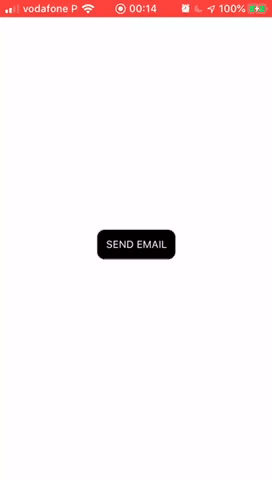

# React Native Email Action

[](https://badge.fury.io/js/react-native-email-action)
[](https://img.shields.io/npm/dy/react-native-email-action)

A simple and customized way to open email linking (Best option for iOS that will ask you what email app you can use, if installed)

## Demo (iOS)



## Installation

```
yarn add react-native-email-action
```

yarn add react-native-email-action

````

### iOS Only

After iOS 9+, you need to add this information keys on Info.plist

```xml
<key>LSApplicationQueriesSchemes</key>
<array>
  <string>message</string>
  <string>ms-outlook</string>
  <string>googlegmail</string>
</array>
````

## Usage

```javascript
import { sendEmail } from 'react-native-email-action';

const options = {
  to: 'erick.maeda26@gmail.com',
  subject: 'Very important!',
  body: 'Verify your email fast!',
};
sendEmail(options);
```

### Configuring Available Email Apps

By default, the library checks for Mail, Outlook, and Gmail. You can customize which email apps are available by using the `configureEmailApps` function:

```javascript
import { sendEmail, configureEmailApps } from 'react-native-email-action';

// Enable specific email apps
configureEmailApps(['mail', 'gmail', 'outlook', 'spark', 'airmail']);

// Or pass appIds directly to sendEmail for one-off usage
sendEmail({
  to: 'user@example.com',
  subject: 'Subject',
  body: 'Body',
  appIds: ['gmail', 'outlook', 'spark'],
});
```

## Available Options to sendMail

|         | description          | type   | required |
| ------- | -------------------- | ------ | -------- |
| to      | Email to destination | string | Y        |
| subject | Email Subject        | string | Y        |
| body    | Email Content        | string | Y        |
| cc      | Email CC             | array  | N        |
| bcc     | Email BCC            | array  | N        |

## Available email apps

### iOS (If installed)

- Mail
- Gmail
- Outlook
- Spark
- Airmail
- Superhuman
- Yahoo Mail
- Fastmail
- ProtonMail

You can use any of these app IDs when calling `configureEmailApps()`: `mail`, `gmail`, `outlook`, `spark`, `airmail`, `superhuman`, `ymail`, `fastmail`, `protonmail`

### Android

- All the apps installed.

## iOS Configuration

After iOS 9+, you need to add the URL schemes for the email apps you want to support in your `Info.plist`:

```xml
<key>LSApplicationQueriesSchemes</key>
<array>
  <string>message</string>
<!-- iOS configuration details are consolidated below -->
  <string>ms-outlook</string>
  <string>googlegmail</string>
  <string>readdle-spark</string>
  <string>airmail</string>
// Basic usage
await sendEmail({
  to: "user@example.com",
  subject: "Very important!",
  body: "Verify your email fast!",
});

// Advanced usage (optional fields)
await sendEmail({
  to: "team@example.com",
  subject: "Status Update",
  body: "Here is the latest…",
  cc: ["mgr@example.com"],
  bcc: ["audit@example.com"],
  cancelText: "Close",
  // On iOS, restrict choices to specific apps for this call
  appIds: ["gmail", "outlook", "spark"],
});

## Available Options to sendEmail
|cc   	|Email CC   	|array<string>   	|N
|bcc   	|Email BCC   	|array<string>   	|N
|cancelText   	|Text for iOS action sheet cancel button   	|string   	|N
|appIds   	|Override list of email apps to offer on iOS (e.g., ["mail","gmail"])   	|array<string>   	|N

Returns a Promise that resolves with the URL used to open the email app.
## Roadmap

## API
- **sendEmail(options)**: Opens the email composer. On iOS, shows an action sheet listing available apps based on `configureEmailApps()` or `options.appIds`.
- **configureEmailApps(appIds)**: Sets the default list of email apps to check on iOS. Use app IDs from the list below.
- ~~Add other app emails for iOS~~ ✅ Done! (configurable)
- Add attachment option

```
